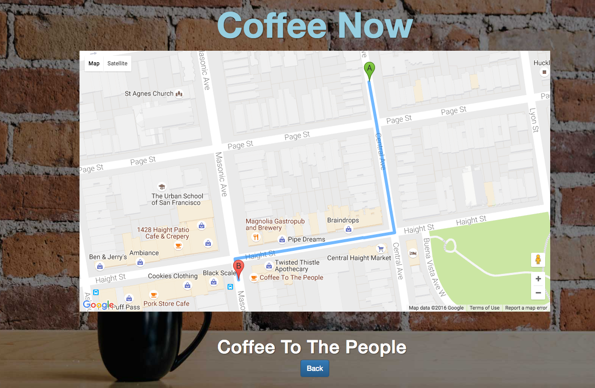

# Coffee Now
This app was initially designed and built in 1 day for an internal bootcamp hackathon for the hackathon we built a web app using Ruby on Rails but plan on building it out for IOS.

## Team
[@kaitlynmcpartland](https://github.com/KaitlynMcPartland)       | [@macroscopic](https://github.com/macroscopic)

## Functionality
Often when you get out of work, or are new to an area, you end up going to numerous coffee shops until you find one that is open. Coffee Now is a one step app where you simply hit the Coffee Now latte button and you are presented with the walking directions on google maps for the nearest open coffee shop. The beauty of Coffee Now is it's one step, you hit one button and have direction to where you want to go. Couldn't get any easier than that!




## Set Up
* Create a .env file and add .env to your .gitignore. In .env add API keys for ```PLACES_API_KEY``` (from the google places api https://developers.google.com/places/web-service/intro), ```GEO_API_KEY``` (from the geolocation google api https://developers.google.com/maps/documentation/geolocation/intro), and a ```JS_API_KEY``` (get the key from google https://developers.google.com/maps/documentation/javascript/).
* Run ```bundle install``` from the command line, then run ```be rake db:drop db:create db:migrate```


